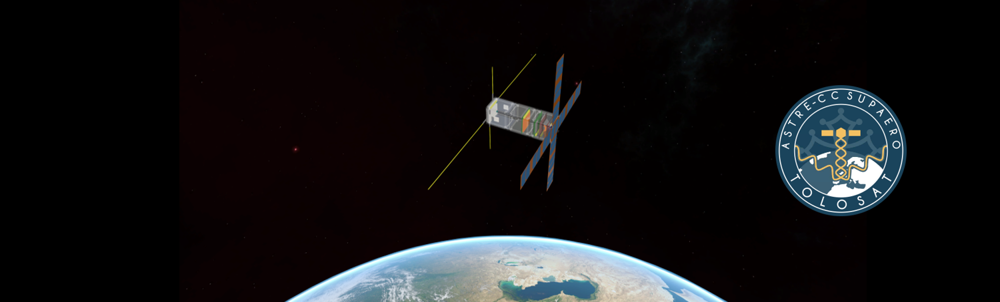

<!-- ## Hi there 👋 -->

## Welcome 

We are a group of students from Toulouse, France working on a nano-satellite mission.

You will find here repositories used by some of our subsystems to collaborate and share their work with the rest of the team.

## Join the GitHub TOLOSAT team 🛰️

If you are a member of TOLOSAT, contact [Arnaud Muller](https://discord.com/users/185822873913393153) on Discord to be invited in the GitHub team.

If not, follow our social media accounts to see when the next application wave is open.

<!--

**Here are some ideas to get you started:**

🙋‍♀️ A short introduction - what is your organization all about?
🌈 Contribution guidelines - how can the community get involved?
👩‍💻 Useful resources - where can the community find your docs? Is there anything else the community should know?
🍿 Fun facts - what does your team eat for breakfast?
🧙 Remember, you can do mighty things with the power of [Markdown](https://docs.github.com/github/writing-on-github/getting-started-with-writing-and-formatting-on-github/basic-writing-and-formatting-syntax)
-->
